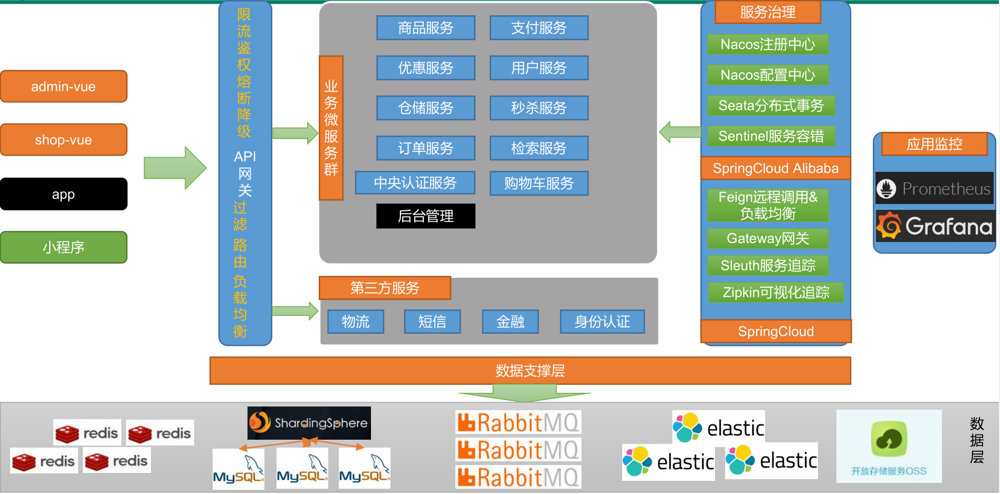
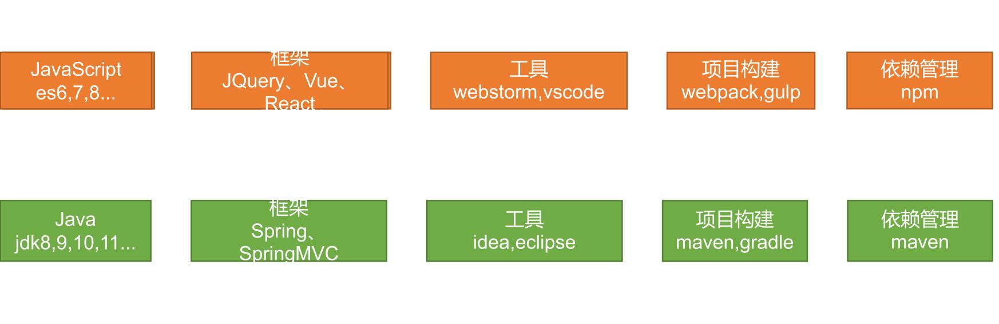
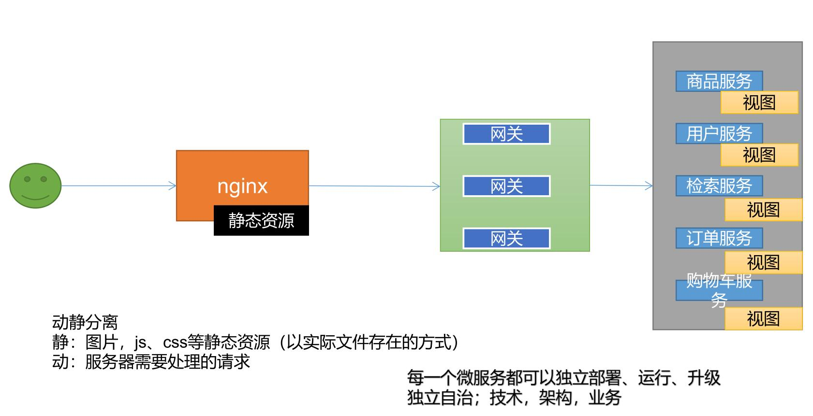
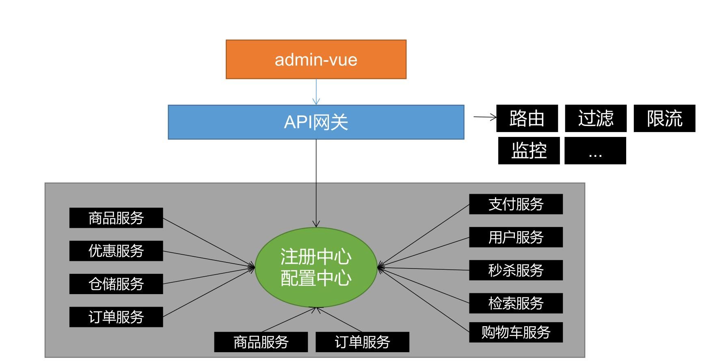
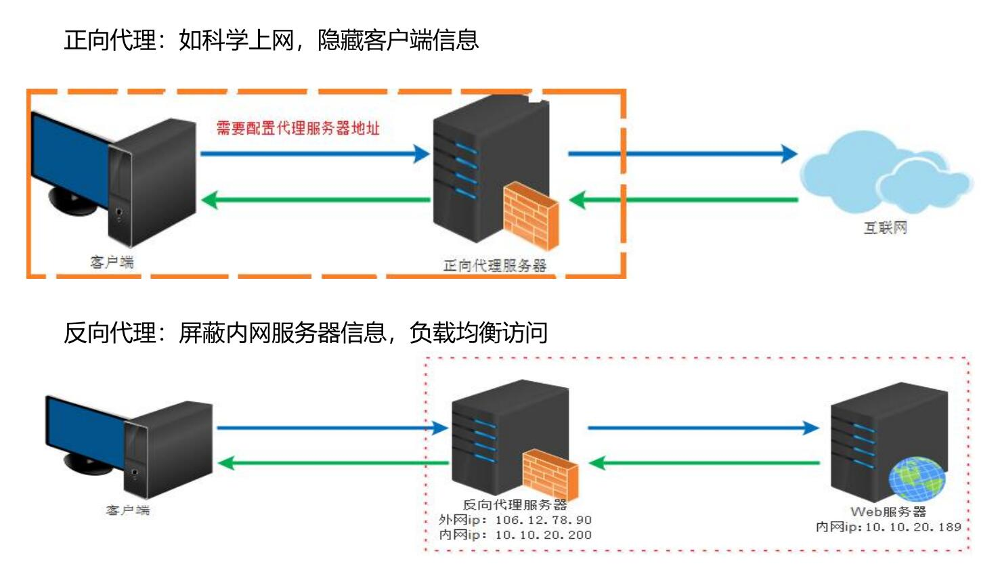
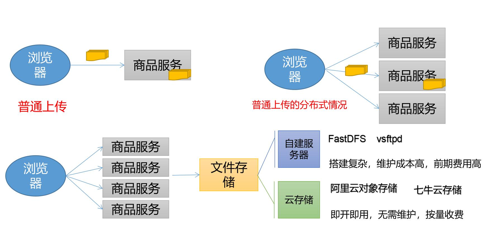
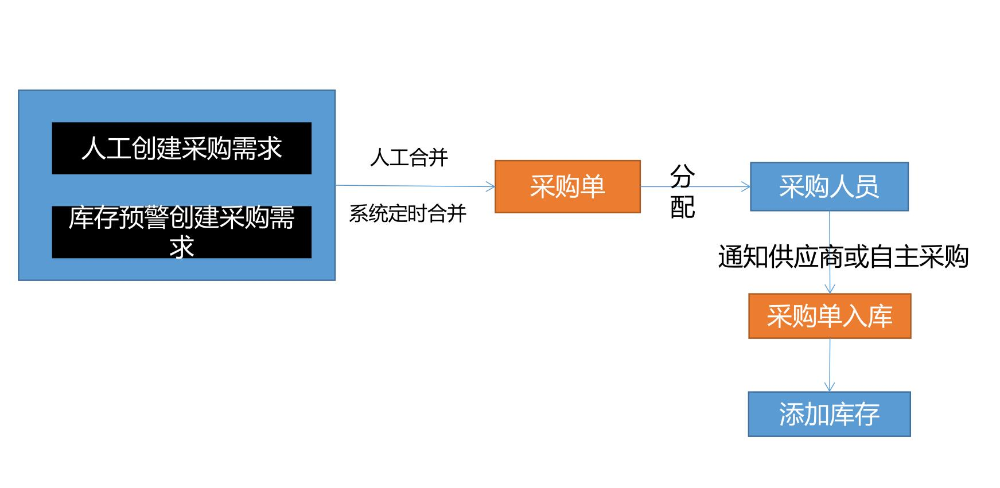
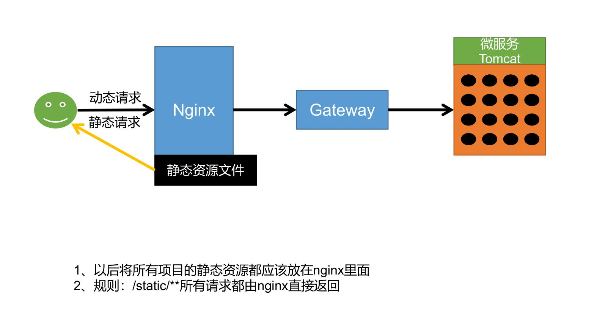
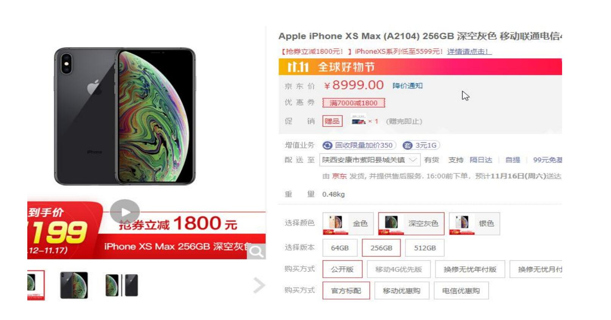
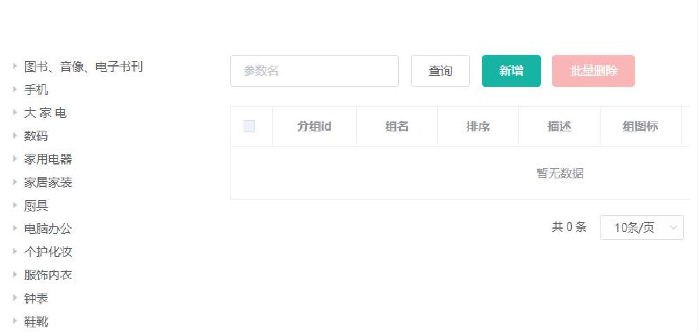

# 谷粒商城 

#  一、项目介绍

谷粒商城项目是完整大型分布式架构电商平台，技术全面、业务深入，全网无出其右。技术涵盖：微服务架构+分布式+全栈+集群+部署+自动化运维+可视化CICD，对标阿里P6/P7，冲击40-60w。

项目由业务集群系统+后台管理系统构成，打通了分布式开发及全栈开发技能，包含前后分离全栈开发、Restful接口、数据校验、网关、注册发现、配置中心、熔断、限流、降级、链路追踪、性能监控、压力测试、系统预警、集群部署、持续集成、持续部署… 

# 二、项目结构

gulimall项目
├── gulimall-common -- 工具类
├── renren-generator -- 代码生成器（人人开源项目）
├── renren-fast -- 后台管理系统（人人开源项目）
├── renren-fast-vue -- 后台管理前端系统（人人开源项目）
├── gulimall-auth-server -- 认证中心（社交登录、OAuth2.0、单点登录）
├── gulimall-cart -- 购物车模块
├── gulimall-coupon -- 优惠券模块
├── gulimall-member -- 会员模块
├── gulimall-gateway -- 网关模块
├── gulimall-order -- 订单模块
├── gulimall-product -- 商品模块
├── gulimall-search -- 检索模块
├── gulimall-seckill -- 秒杀模块
├── gulimall-third-party -- 第三方模块（短信、OSS）
└── gulimall-ware -- 仓储模块

# 三、微服务架构

